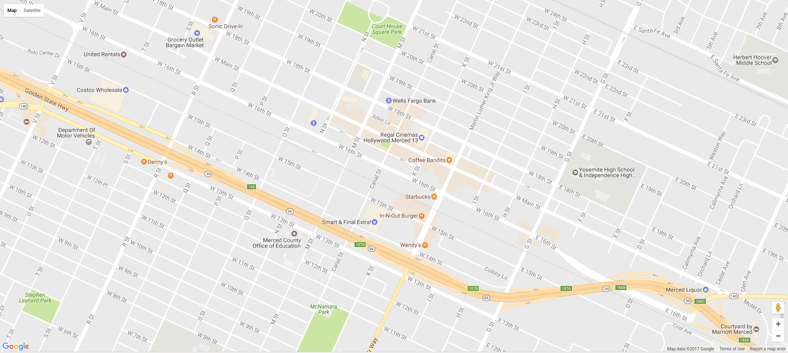

# Ionic and Google Maps Native SDK v2



## About
Using using **Google Maps Native SDK v2** and **[Ionic Framework](http://ionicframework.com)**, create the Ionic-Google_Map project.
This Ionic-Google_Map example is written by [Big Silver].

## Dependencies

- Ionic CLI installed (required)
- Cordova 5.x.x installed (required)
- \***Android** and/or iOS environment installed (optional, but required if you don't have devices to test)

\*To run the starter inside an Android Virtual Device, you need request Google Play Services into the Android Emulator Environment and change the project configurations to use it.

## Quick Start

For begin, clone this project and run the following commands in your terminal:

```ssh
$ git clone https://github.com/Big-Silver/Ionic-GoogleMap.git ionic-google-maps-starter
$ cd ionic-google-maps-starter 
$ npm install
$ ionic serve
```
And add Google Maps JavaScript SDK API_Key in index.html

```bash
In index.html

<!DOCTYPE html>
<html>
    <head>
        <meta charset="utf-8">
        <meta name="viewport" content="initial-scale=1, maximum-scale=1, user-scalable=no, width=device-width">
        <title></title>
        <link href="lib/ionic/css/ionic.css" rel="stylesheet">
        <link href="css/style.css" rel="stylesheet">
        <script src="lib/ionic/js/ionic.bundle.js"></script>
        <script src="cordova.js"></script>
        <script src="js/app.js"></script>
    </head>
    <body ng-app="starter">
        <ion-pane>
            <ion-header-bar class="bar-stable">
                <h1 class="title">Ionic Blank Starter</h1>
            </ion-header-bar>
            <ion-content>
            </ion-content>
        </ion-pane>
        <script src="http://maps.googleapis.com/maps/api/js?key=[YOUR_KEY_HERE]&sensor=true"></script>
    </body>
</html>

```